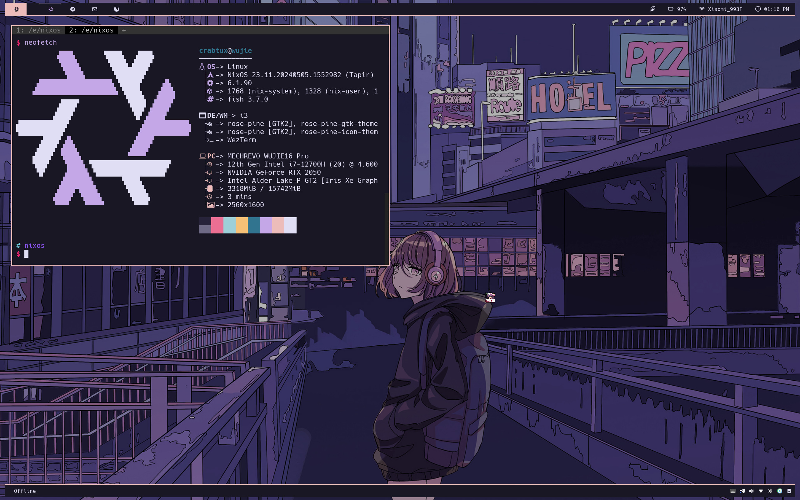
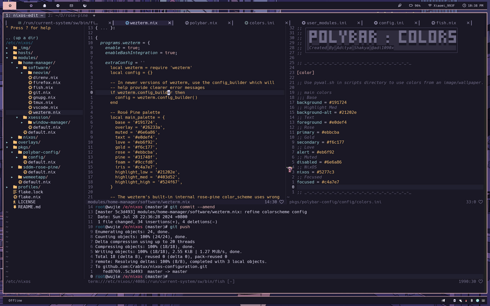

# NixOS Configuration

## Screenshots

## 一些信息

这套配置由我日常使用，里面包含：

- 一个给 PC 用的 NixOS + Home Manager 配置
  - Home Manager 作为 NixOS 的模块使用
- 一个给服务器用的 Standalone Home Manager 配置

配置分为服务器端和桌面端，使用自行编写的 [rain](modules/nixos/rain) 模块定义了一系列预设配置和配置选项，以期在多机场景下实现快速的声明式配置（此模块将长期处于开发阶段）。

对于桌面端，使用的部分组件信息如下：

- Color Scheme: [Rosé Pine](https://github.com/rose-pine)
- Shell: Fish
- Terminal Emulator: Wezterm
- Fonts:
  - zh: 思源黑体
  - en: Hack
- Desktop Manager: Xfce
- Window Manager: i3wm
- Display Manager: sddm
- Screensaver: i3lock-fancy with xautolock
- Application Launcher: Rofi
- Status Bar: Polybar
- Compositor: Picom

Polybar 和 Rofi 的主题，修改自 [adi1090x/polybar-themes](https://github.com/adi1090x/polybar-themes)。

整体配置和设计思路，参考了 [Misterio77/nix-starter-configs](https://github.com/Misterio77/nix-starter-configs)，和 [NixOS-CN](https://github.com/nixos-cn/NixOS-CN-telegram) 一些群友的配置，在此表示感谢。

## TODO

- 给这个 [鼠标指针主题](https://www.xfce-look.org/p/2077667) 打包
- 在更多机器上使用 Nix 和 NixOS
- Secret Management（比如用 sops-nix）
